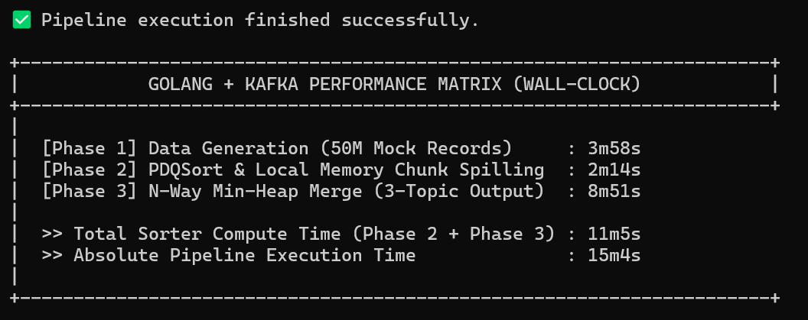
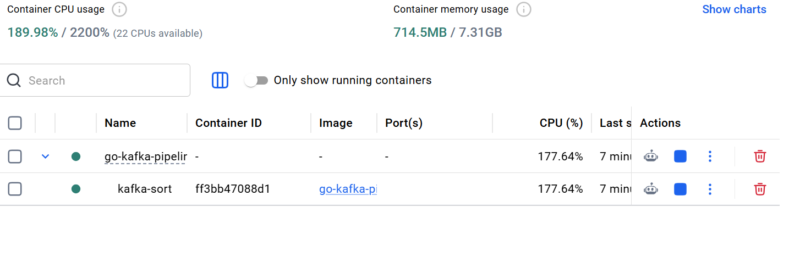

# High-Performance Kafka Data Pipeline

A production-ready, highly optimized data engineering pipeline built in **Go (Golang)**. This system generates 50 million records, streams them through Apache Kafka, and performs an external n-way merge sort while strictly adhering to hardware constraints (2GB RAM / 4 CPU Cores).

## 📋 Table of Contents
1. [Project Overview](#project-overview)
2. [Architecture & Workflow](#architecture--workflow)
3. [Hardware Constraints & Optimizations](#hardware-constraints--optimizations)
4. [Project Structure](#project-structure)
5. [Step-by-Step Setup & Execution](#step-by-step-setup--execution)
6. [Verification](#verification)
7. [Algorithm Details](#algorithm-details)
8. [Performance & Scaling](#performance--scaling)

---

## Project Overview

This pipeline is designed to handle massive data processing under extreme resource limitations. It performs the following:
1. **Generates** 50 million lines of random CSV data.
2. **Publishes** data to a Kafka topic called `source`.
3. **Consumes** and **Sorts** the data three different ways (by ID, Name, and Continent).
4. **Publishes** sorted results to three separate Kafka topics (`id`, `name`, `continent`).

### Data Schema
| Column | Type | Description |
| :--- | :--- | :--- |
| **id** | `int32` | 32-bit integer |
| **name** | `string` | English letters only (10-15 chars) |
| **address** | `string` | Alphanumeric (15-20 chars) |
| **Continent**| `string` | One of 6 predefined continents |

---

## Architecture & Workflow

The system utilizes an **N-Way External Merge Sort** algorithm to process data larger than the available RAM.


### The Lifecycle of Data:
1. **Generation (Record Generator)**: 50M records are streamed into Kafka.
2. **Chunking (Ingestion)**: Data is consumed in 1M-record chunks, sorted in RAM (using `pdqsort`), and spilled to disk as temporary CSV files.
3. **N-Way Merge (Sorter)**: The system opens all chunk files simultaneously and uses a **Min-Heap (Priority Queue)** to stream globally sorted records back to Kafka.

---

## Hardware Constraints & Optimizations

This project was built to run inside a strictly limited container:
* **RAM Limit**: 2 GB (Total cluster: Zookeeper + Kafka + Go App)
* **CPU Limit**: 4 Cores

### How we handle the limits:
* **Sequential Merges**: To prevent memory spikes, the three output topics (`id`, `name`, `continent`) are processed **sequentially**, ensuring the k-way merge buffers never exceed the 2GB limit.
* **Aggressive Garbage Collection**: The Go runtime is manually triggered after every chunk flush and between merge phases to reclaim memory.
* **Memory Pooling**: Byte buffers are reused to minimize allocation overhead.
* **Disk Spilling**: By treating the SSD as temporary RAM, we can sort 5-8GB of data while only using ~300MB of active app heap.


---

## 📂 Project Structure

```text
go-kafka-pipeline/
├── cmd/
│   └── pipeline/
│       └── main.go         # Entry point (modes: full, generate, process, verify)
├── models/
│   └── record.go           # Data schema and CSV logic
├── sort/
│   ├── chunk_sort.go       # Local sorting and disk spilling
│   ├── merge.go            # Min-Heap N-Way merge logic
│   ├── processor.go        # Orchestrates the ingestion and merge phases
│   └── verify.go           # Logical verification of output topics
├── source/
│   └── generator.go        # Fast concurrent record generation
├── scripts/
│   ├── entrypoint.sh       # Container bootstrapper and tuning
│   └── verify.sh           # Convenience script for quick inspection
├── docs/                   # Project screenshots and diagrams
├── docker-compose.yml      # Orchestrates Zookeeper, Kafka, and the App
├── Dockerfile              # Multi-stage build for the Go application
└── README.md
```

---

## Step-by-Step Setup & Execution

### 1. Build the Application
```bash
docker-compose build
```

### 2. Start the Pipeline
```bash
docker-compose up -d
```

### 3. Monitor Progress
You can watch the logs in real-time to see the progress:
```bash
docker-compose logs -f app
```


---

## Verification

Once the logs indicate "Pipeline execution is complete!", you can verify the results.

### Automated Verification
```bash
docker-compose exec app /app/verify.sh
```


### Manual Inspection
```bash
docker-compose exec app /opt/kafka/bin/kafka-console-consumer.sh --bootstrap-server localhost:9092 --topic id --from-beginning --max-messages 10
```

---

## Algorithm Details

### Segment 1: High-Speed Production
* Generates synthetic records locally.
* Uses multi-worker goroutines to publish to Kafka in batches of 10,000.
* Optimized for high throughput to fill the `source` topic rapidly.

### Segment 2: External Merge Sort
* **Phase 1 (Chunking)**: Reads records from Kafka into a 1-million record buffer. Each buffer is sorted locally and written to disk. This ensures we never hold more than 1M records in RAM at any given time.
* **Phase 2 (N-Way Merge)**: Simultaneously reads the first record from every chunk file. Uses a Min-Heap to determine the smallest value, writes it to the output Kafka topic, and pulls the next record from the corresponding file.

---

## Performance & Scaling

### Current Performance (50M Records)
- **Generation Phase**: 3m 58s
- **Disk Spilling**: 2m 14s
- **Final Merge**: 8m 51s
- **Total Absolute Execution**: **15m 04s**



### Bottlenecks
* **Disk I/O**: The system is heavily dependent on SSD speed because it treats the disk as temporary RAM.
* **Network Throughput**: Kafka serialization and network overhead factor in when moving 50M records twice.

### Future Scaling
* **Vertical Scaling**: Increasing RAM would allow for larger chunks, reducing disk I/O.
* **Horizontal Scaling**: Partitioning the work across multiple Sorter containers would allow parallel merges across different key ranges.

---
**👨‍💻 Author**: Likitha
