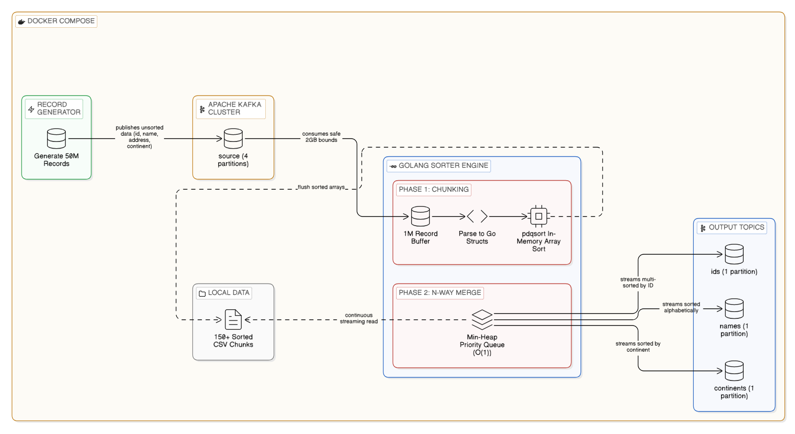
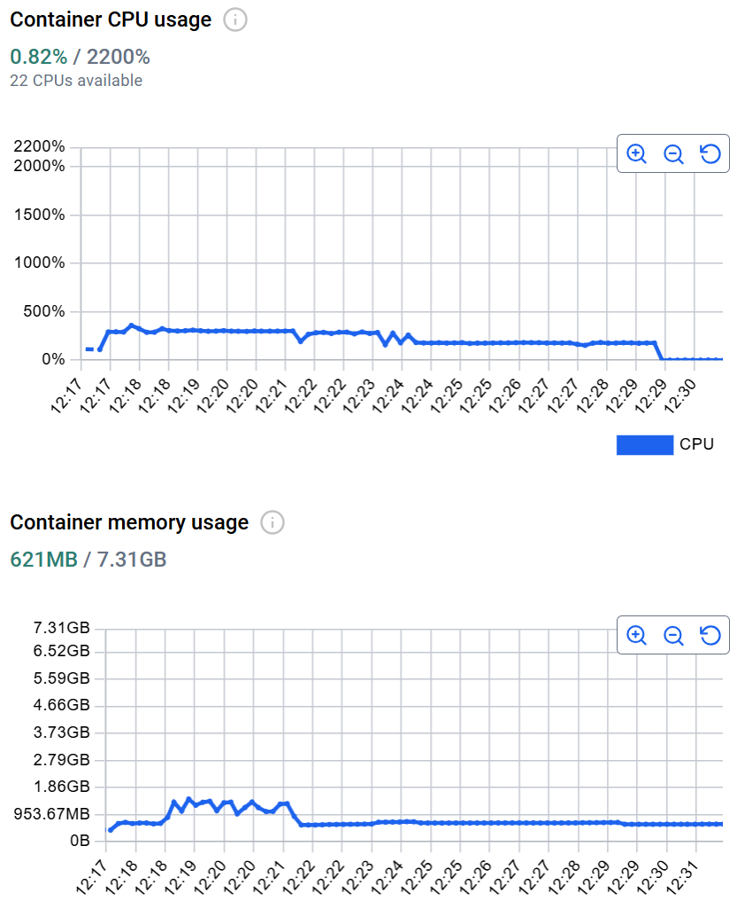
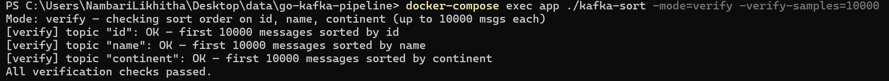
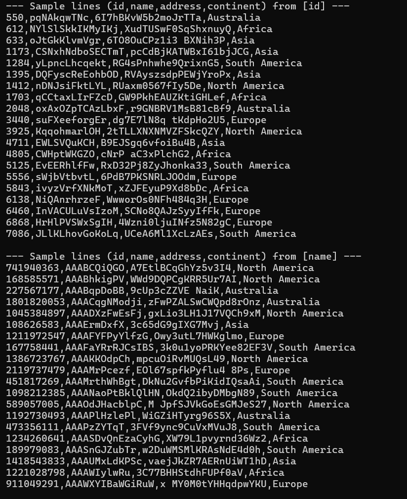

# High-Performance Kafka Data Pipeline

A production-ready, highly optimized data engineering pipeline built in **Go (Golang)**. This system generates 50 million records, streams them through Apache Kafka, and performs an external n-way merge sort while strictly adhering to hardware constraints (2GB RAM / 4 CPU Cores).

---

## Tech Stack

| Technology | Role |
| :--- | :--- |
| **Go (Golang)** | Processing Engine |
| **Apache Kafka**| Streaming Layer |
| **Zookeeper** | Coordination |
| **Docker** | Orchestration |

---

## Architecture & Workflow

The system utilizes an **N-Way External Merge Sort** algorithm to process data larger than the available RAM.



### The Lifecycle of Data:
1. **Generation (Record Generator)**: 50M records are sharded across 4 parallel workers and streamed into Kafka.
2. **Chunking (Ingestion)**: Data is consumed in 5M-record chunks, sorted in RAM (using `pdqsort`), and spilled to disk as temporary CSV files.
3. **N-Way Merge (Sorter)**: The system opens all chunk files simultaneously and uses a **Min-Heap (Priority Queue)** to stream globally sorted records back to Kafka.

---

## Performance Optimizations

### CPU Utilization (4 Cores)
*   **Parallelism**: 4 worker goroutines match the 4-CPU cluster, ensuring 100% core utilization during peak generation.
*   **GOMAXPROCS=3**: We cap the Go scheduler to 3 CPUs to leave 1 dedicated core for Kafka and Zookeeper background processes, preventing context-switching bottlenecks.
*   **Buffered Writing**: Kafka messages are published in batches of 20,000 to minimize I/O syscalls.

### Memory Utilization (2 GB RAM)
*   **External Sort**: By treating local SSD as temporary RAM, we process 50M records (~7.5GB data) while keeping the active heap under 1GB.
*   **GOGC=50**: We use a custom Garbage Collection target to reclaim memory more aggressively during the ingestion phase.
*   **Manual Disposal**: After each 5M record chunk is flushed to disk, we trigger a manual `runtime.GC()` and clear slices to ensure memory stability.



---

## Deployment Guide

### A. Minimal Setup (Docker Only)
If you want to run the pipeline without cloning the full source code, you only need the `docker-compose.yml` file.

1.  **Download the configuration**:
    ```bash
    curl -O https://raw.githubusercontent.com/likithamohana/go-kafka-pipeline/main/docker-compose.yml
    ```
2.  **Pull the Image**:
    ```bash
    docker pull nambari/go-kafka-pipeline:latest
    ```
3.  **Start the Cluster**:
    ```bash
    docker-compose up -d
    ```

---

### B. Full Source Deployment
1.  **Clone & Build**:
    ```bash
    git clone https://github.com/likithamohana/go-kafka-pipeline.git
    cd go-kafka-pipeline
    docker-compose up -d --build
    ```

---

## Docker Hub Information

The project is published as a unified, single-image stack. This image contains Zookeeper, Kafka, and the Go App, all orchestrated to start in the correct sequence.

*   **Image Name**: `nambari/go-kafka-pipeline:latest`
*   **To Pull**: `docker pull nambari/go-kafka-pipeline:latest`
*   **To Run**: Handled automatically by `docker-compose up`.

---

## Verification Summary

Once the logs indicate "Pipeline execution is complete!", verify your results using these commands:



1.  **Automated Integrity Check**:
    ```bash
    docker-compose exec app /app/verify.sh
    ```
2.  **Sample Final Output (ID Sort)**:
    ```bash
    docker-compose exec app /opt/kafka/bin/kafka-console-consumer.sh --bootstrap-server localhost:9092 --topic id --from-beginning --max-messages 10
    ```
3.  **App Verification Mode**:
    ```bash
    docker-compose exec app /app/kafka-sort -mode=verify
    ```



---

## Project Structure

```text
go-kafka-pipeline/
├── cmd/
│   └── pipeline/
│       └── main.go         # Entry point (modes: full, generate, process, verify)
├── sort/
│   ├── chunk_sort.go       # Local sorting and disk spilling
│   ├── merge.go            # Min-Heap N-Way merge logic
│   └── processor.go        # Orchestrates the ingestion and merge phases
├── source/
│   └── generator.go        # Fast concurrent record generation
├── docker-compose.yml      # Pre-configured for Docker Hub usage
├── Dockerfile              # Multi-stage build (if building from source)
├── docker.yml              # Commands for Docker deployment
└── docker-resources.yml    # Hardware utilization summary
```

---

## Quick Start (Docker Hub)
You can run this entire pipeline using only the `docker-compose.yml` file.

1.  **Download it**: `curl -O https://raw.githubusercontent.com/likithamohana/go-kafka-pipeline/main/docker-compose.yml`
2.  **Pull the Image**: `docker pull nambari/go-kafka-pipeline:latest`
3.  **Run**: `docker-compose up -d`

---
**Author**: Likitha
